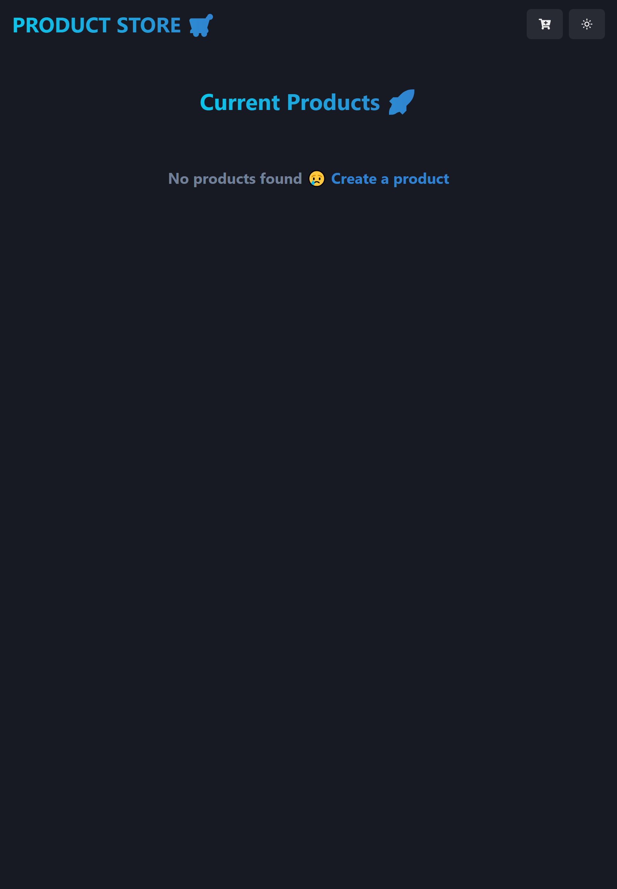
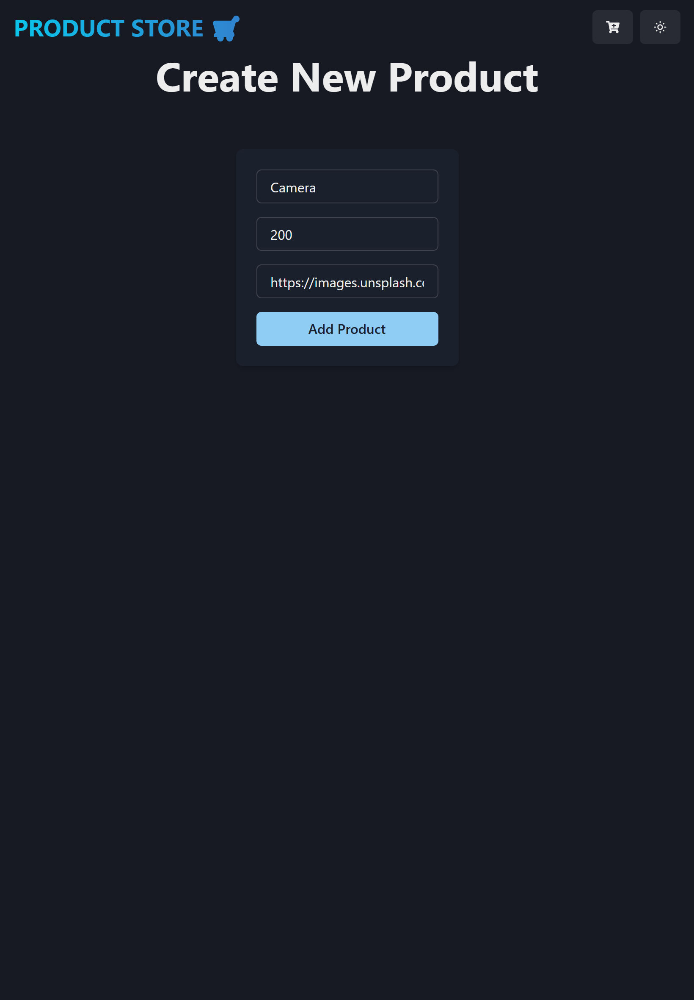
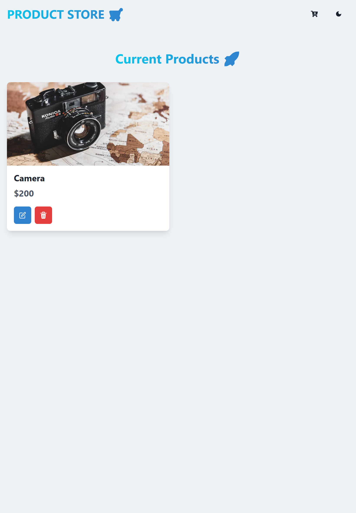

# Mern-Cart
Mern Cart Page Where We Can Add, Upade,Delete The Products 

Welcome to **Mern Cart Page**! This guide will help you set up and run the project on your local machine.

## Prerequisites

Before you begin, make sure you have the following installed on your system:

1. **Node.js**: [Download Node.js](https://nodejs.org/)
2. **MongoDB**: Either a local MongoDB instance or a cloud-based MongoDB service (e.g., MongoDB Atlas).

## Getting Started

Follow these steps to clone the repository, configure the project, and run it locally.

### 1. Clone the Repository

Run the following command to clone this repository to your local machine:
```bash
git clone https://github.com/arunKumar2025/Mern-Cart.git
```
### 2. Create a .env file and your PORT and MONGODB url as MONGO_URI

### 3. Run the below cmd to install node_modules

```bash
npm run build
```

### 4. Start project by run the cmd showing below

```bash
npm run start 

```
### 5. Navigate to the url that shows up on the terminal using any browser 

## Page Without Products



## Add Product Chakra Ui Modal



## Theme Option




